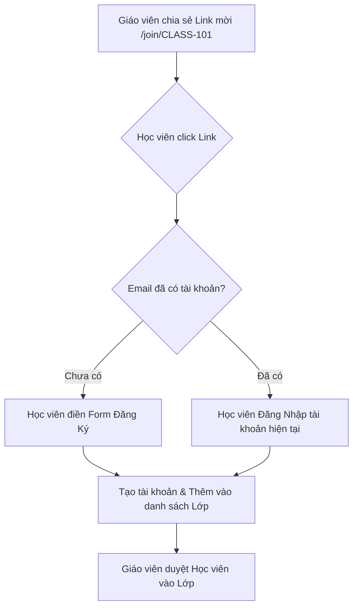

# 👤 User Architecture & Authentication Specification (`USERS.md`)

## 1. Overview
Hệ thống sử dụng **Supabase Auth (Native)** với **Cookie-based Session** (`@supabase/ssr`) kết hợp với **PostgreSQL Trigger** và **Neo4j Graph Database Sync** để quản lý người dùng, phiên đăng nhập và phân quyền đa tầng (`STUDENT`, `TEACHER`, `ADMIN`).

---

## 2. User Data Architecture & Schema

### 2.1. Dual-Schema User Mapping (`auth.users` 1-to-1 `public.users`)
- **`auth.users` (Schema `auth`)**: Bảng hệ thống bảo mật do Supabase Engine quản lý.
  - Lưu trữ: `id` (UUID), `email`, `encrypted_password` (Bcrypt Hash), `email_confirmed_at`, `raw_user_meta_data`.
  - **Bảo mật**: Khóa chặt schema, không cho phép Client API query trực tiếp.
- **`public.users` (Schema `public`)**: Bảng ứng dụng chính của hệ thống.
  - Khóa chính `id` là Foreign Key nối 1-1 tới `auth.users(id)` với cờ `ON DELETE CASCADE`.
  - **ĐÃ XÓA** cột `password` plain-text. Mật khẩu duy nhất nằm trong `auth.users`.

```sql
-- DDL Bảng public.users trong PostgreSQL
CREATE TABLE IF NOT EXISTS public.users (
  id UUID PRIMARY KEY REFERENCES auth.users(id) ON DELETE CASCADE,
  email TEXT UNIQUE NOT NULL,
  name TEXT NOT NULL,
  phone TEXT,
  role TEXT NOT NULL DEFAULT 'STUDENT' CHECK (role IN ('STUDENT', 'TEACHER', 'ADMIN')),
  must_change_password BOOLEAN DEFAULT false,
  created_at TIMESTAMPTZ DEFAULT NOW(),
  updated_at TIMESTAMPTZ DEFAULT NOW()
);
```

---

## 3. PostgreSQL Database Trigger (`on_auth_user_created`)

Khi người dùng Đăng ký thành công qua Supabase Auth API, một Database Trigger sẽ tự động chèn bản ghi tương ứng vào `public.users` trong cùng 1 Transaction:

```sql
CREATE OR REPLACE FUNCTION public.handle_new_user()
RETURNS TRIGGER AS $$
BEGIN
  INSERT INTO public.users (id, email, name, phone, role, must_change_password)
  VALUES (
    NEW.id,
    NEW.email,
    COALESCE(NEW.raw_user_meta_data->>'full_name', NEW.raw_user_meta_data->>'name', split_part(NEW.email, '@', 1)),
    NEW.raw_user_meta_data->>'phone',
    COALESCE(NEW.raw_user_meta_data->>'role', 'STUDENT'),
    COALESCE((NEW.raw_user_meta_data->>'must_change_password')::boolean, false)
  );
  RETURN NEW;
END;
$$ LANGUAGE plpgsql SECURITY DEFINER;

-- Trigger Triggered On New Registration
CREATE OR REPLACE TRIGGER on_auth_user_created
  AFTER INSERT ON auth.users
  FOR EACH ROW EXECUTE FUNCTION public.handle_new_user();
```

---

## 4. Role-Based Access Control (RBAC) & Registration Rules

| Phân Quyền (`role`) | Đăng Ký Công Khai (`/register`) | Quyền Hạn Trong Hệ Thống | Default Redirect Landing |
| :--- | :--- | :--- | :--- |
| **`STUDENT`** | **CHO PHÉP** (Chỉ gõ Name, Email, Password, Phone) | Làm bài thi, học Flashcard, xem điểm cá nhân, đổi mật khẩu. | `/student/dashboard` |
| **`TEACHER`** | **BỊ CẤM** (Chỉ Admin khởi tạo qua Admin Dashboard) | Soạn đề thi, quản lý lớp học, chấm điểm bài luận, tạo học viên. | `/teacher/classes` |
| **`ADMIN`** | **BỊ CẤM** (Chỉ khởi tạo qua Seed / System Script) | Toàn quyền hệ thống, tạo tài khoản Giáo viên, xem log AI, cấu hình hệ thống. | `/admin/users` |

---

## 5. Route Protection & Next.js Middleware Policy

Next.js Middleware (`middleware.ts`) chạy ở Edge Runtime để kiểm tra Cookie Session của Supabase và phân quyền Route:

1. **Unauthenticated Redirect**:
   - Khách truy cập trang bảo vệ (`/student/*`, `/teacher/*`, `/admin/*`, `/profile`) $\rightarrow$ Redirect về `/login?redirectTo=<current_path>`.
2. **Authenticated Guest Redirect**:
   - Đã đăng nhập nhưng cố truy cập `/login` hoặc `/register` $\rightarrow$ Redirect về Dashboard đúng theo Role.
3. **Cross-Role Violation Protection**:
   - `STUDENT` truy cập route của `TEACHER` hoặc `ADMIN` $\rightarrow$ Redirect về `/student/dashboard` với Toast thông báo 403 Forbidden.
4. **Force Password Change**:
   - Nếu `user.must_change_password === true` $\rightarrow$ Cưỡng chế Redirect về `/change-password` cho tới khi hoàn tất.

---

## 6. Auth Routes Sitemap

- `/login`: Đăng nhập hệ thống (Email + Mật khẩu).
- `/register`: Đăng ký tài khoản Học viên mới công khai.
- `/forgot-password`: Yêu cầu gửi mail đặt lại mật khẩu.
- `/reset-password`: Trang nhập mật khẩu mới từ link Email recovery token.
- `/change-password`: Trang cưỡng chế đổi mật khẩu lần đầu cho tài khoản do Admin cấp.

---

## 7. Neo4j Graph DB User Node Sync Policy

Khi người dùng đăng ký hoặc đăng nhập lần đầu, hệ thống gọi hàm `syncUserToNeo4j({ id, name, email, role })` để tạo hoặc cập nhật Node `(u:User {id: uuid, name: string, email: string, role: string})` trên Neo4j DB.

---

## 8. Admin & Teacher Account Provisioning (`/api/admin/create-user`)

### 8.1. Nguyên Lý Khởi Tạo Tài Khoản Không Mất Session (Admin Service Role API)
Khi Admin tạo tài khoản cho Giáo viên/Học sinh, hoặc Giáo viên tạo tài khoản Học sinh, nếu gọi `signUp()` ở Client side sẽ bị mất phiên đăng nhập (Logout).
Do đó, hệ thống sử dụng **Next.js Server Action / API Route (`/api/admin/create-user`)** kết hợp với **Supabase Service Role Client (`SUPABASE_SERVICE_ROLE_KEY`)**:

```ts
// Ví dụ API Route /api/admin/create-user
import { createClient } from '@supabase/supabase-js';

const supabaseAdmin = createClient(
  process.env.NEXT_PUBLIC_SUPABASE_URL!,
  process.env.SUPABASE_SERVICE_ROLE_KEY!
);

export async function POST(req: Request) {
  // 1. Validate Caller Session (Chỉ cho phép ADMIN hoặc TEACHER)
  // 2. Gọi Supabase Admin API để tạo user trong auth.users
  const { data: authUser, error } = await supabaseAdmin.auth.admin.createUser({
    email,
    password: tempPassword,
    email_confirm: true, // Auto confirm email cho tài khoản cấp nội bộ
    user_metadata: {
      full_name: name,
      phone,
      role: targetRole, // "TEACHER" hoặc "STUDENT"
      must_change_password: true, // Cưỡng chế đổi mật khẩu lần đầu
    }
  });

  // 3. PostgreSQL Trigger (on_auth_user_created) sẽ tự động sync sang public.users
  // 4. Ghi danh lớp học (Enrollments) và Sync Node sang Neo4j DB.
}
```

### 8.2. Phân Quyền Khởi Tạo Tài Khoản (Creation Matrix)

| Người Khởi Tạo | Được Tạo Quyền Gì? | Mật Khẩu Khởi Tạo | Trạng Thái Đổi Mật Khẩu |
| :--- | :--- | :--- | :--- |
| **`ADMIN`** | `TEACHER` hoặc `STUDENT` | Mật khẩu tạm (VD: `123456` hoặc do Admin chỉ định) | `must_change_password = true` |
| **`TEACHER`** | Chỉ `STUDENT` (Thuộc các lớp Giáo viên phụ trách) | Mật khẩu tạm (VD: `123456`) | `must_change_password = true` |
| **`STUDENT`** | **BỊ CẤM HOÀN TOÀN** | N/A | N/A |

### 8.3. Luồng Onboarding & Đổi Mật Khẩu Lần Đầu (First-Time Login Onboarding)

1. **Khởi Tạo Tối Giản**:
   - Admin/Giáo viên hoặc Form đăng ký công khai chỉ cần nhập thông tin cơ bản: **`username` (hoặc email)**, **`fullName` (optional)** và **Mật khẩu**.
   - Tài khoản được gán cờ `must_change_password = true`.

2. **Đăng Nhập Lần Đầu & Cưỡng Chế Onboarding (`/change-password`)**:
   - Khi người dùng đăng nhập tại `/login` bằng tài khoản mới, Middleware phát hiện `must_change_password === true` $\rightarrow$ Chuyển hướng cưỡng chế sang trang **`/change-password`**.

3. **Form Đổi Mật Khẩu & Hoàn Thiện Thông Tin Profile (`/change-password`)**:
   - Trang `/change-password` tích hợp luồng Onboarding hoàn thiện thông tin tài khoản:
     - 🔐 **Mật khẩu mới** & Xác nhận mật khẩu mới.
     - 👤 **Họ và tên đầy đủ** (Full Name).
     - 📞 **Số điện thoại** (Phone Number).
     - 🎯 **Mục tiêu học tập / Target Band** (đối với Học viên, VD: IELTS 7.0).

4. **Kích Hoạt Tài Khoản Trực Tiếp**:
   - Khi submit form:
     - Mật khẩu mới được cập nhật mã hóa trong `auth.users`.
     - Các thông tin profile (`name`, `phone`, `target_band`) được cập nhật vào `public.users`.
     - Cờ `must_change_password` chuyển thành `false`.


---

## 9. Self-Serve Student Registration via Class Invite Links (`/join/[classCode]`)

### 9.1. Bài Toán & Động Lực Kiến Trúc
Việc yêu cầu Giáo viên phải tự tạo thủ công hàng loạt tài khoản Học sinh gây tốn thời gian và công sức quản lý. Hệ thống hỗ trợ cơ chế **Tự Đăng Ký Qua Link Mời Lớp Học (Self-Serve Registration via Class Invite Link)** giúp tự động hóa 100% luồng ghi danh.

### 9.2. Giải Pháp Chống Tài Khoản Rác & Trùng Lặp (4-Tier Protection Architecture)

1. **Ràng Buộc Định Danh Duy Nhất (Unique Identity Constraint)**:
   - Mỗi Học viên sử dụng 1 Địa chỉ Email duy nhất.
   - Nếu Học viên đã có tài khoản trên hệ thống và bấm vào Link mời: Hệ thống không tạo tài khoản mới mà chuyển hướng sang giao diện **"Đăng Nhập Để Ghi Danh"**, nối `student_id` hiện tại với `class_id` mới.

2. **Link Mời Lớp Thông Minh (Smart Class Invite Links)**:
   - Giáo viên tạo Link mời dạng: `https://edutest.edu.vn/join/[classCode]?token=[inviteToken]`
   - Hỗ trợ thiết lập giới hạn số lượt đăng ký (Seat Limit) và thời hạn hiệu lực (Expiration Date).

3. **Hàng Chờ Duyệt Lớp Cho Giáo Viên (Pending Class Approval Queue)**:
   - Học viên tự đăng ký qua link được xếp vào danh sách `PENDING_APPROVAL` của lớp đó.
   - Giáo viên có quyền duyệt 1-click hoặc từ chối học viên lạ/spam.

4. **Sơ Đồ Luồng Tự Đăng Ký & Ghi Danh**:




